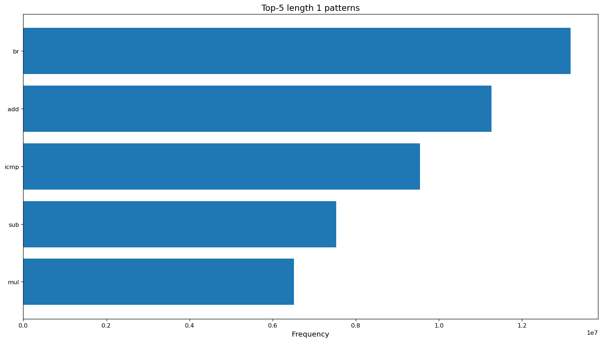
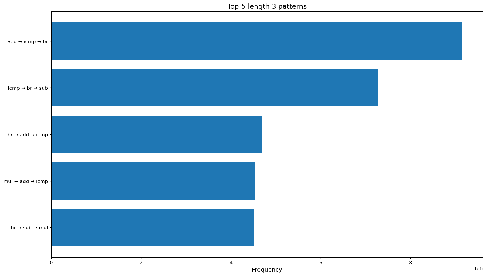
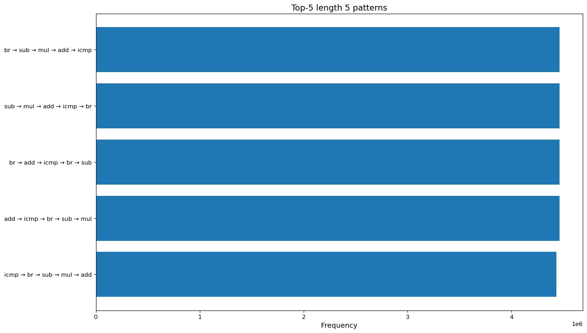

# Task 2 - instrumented graphical app

## Build steps
```
mkdir build
cmake -B build -DCMAKE_C_COMPILER=clang -DCMAKE_CXX_COMPILER=clang++
cmake --build build --target task-02
```

## Most frequent instruction patterns:
## Sample results:






